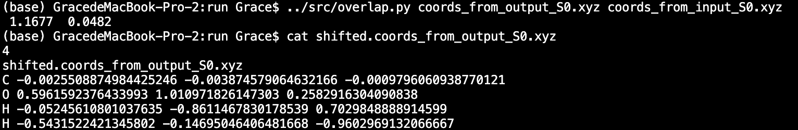
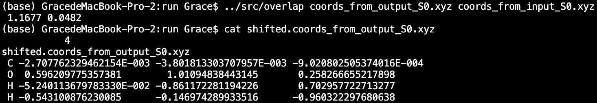

# Align two molecules 

## Table of Content
- [Align two molecules](#align-two-molecules)
  - [Table of Content](#table-of-content)
  - [Aim and References](#aim-and-references)
  - [Usage](#usage)
  - [Examples with Screenshots](#examples-with-screenshots)

## Aim and References
* Overlap two rigid bodies by translation followed by rotation (Kabsch algorithm). 
* Supporting information of [Construction of Two-Dimensional Potential Energy Surfaces of Reactions with Post-Transition-State Bifurcations.][1]
* Appendix A of author's dissertation.
* **Author** : Hsiao-Han (Grace) Chuang

[1]: https://pubs.acs.org/doi/10.1021/acs.jctc.0c00172

## Usage

- In /src, both `overlap.f90` and `overlap.py` do the same things; overlap two ridge bodies. 
- Use `makefile` to compile Fortran code.

- Input: 
    1. Structure to be varied: $1, extension: .xyz
    2. Reference structure; $2, extension: .xyz

## Examples with Screenshots 

Prepare two input files for program `overlap.py` or `overlap.f90`, and above input files follow the standard file format which can also be executed by general visualizer, like `jmol`. 

The first input file is `coord_from_output_S0.xyz` in folder `./run`, which has C-O bond length as 0.121 nm. This is the structure to be varied.

        </img>

The second input file is `coord_from_input_S0.xyz` in the same folder as above file, which has C-O bond length as 0.123 nm. This is the reference structure.

    </img>

 

Execute the program and change the coordinate of `coords_from_output_S0.xyz` into `shifted.coords_from_output_S0.xyz`. The screenshots of python and Fortran are shown as followed. 

Execute the python code `overlap.py`, and it prints out the initial/final RMSD and also produces shifted structure as followed. 

        </img>

 

And then, Fortran code is executed to compare with python result, which is the same for both initial/final RMSD and shifted structure. 

        </img>

 

After translation and rotation, RMSD changes from 1.1677 to 0.0482, and the characteristic bond length of C-O is still reserved. 

        </img>

 