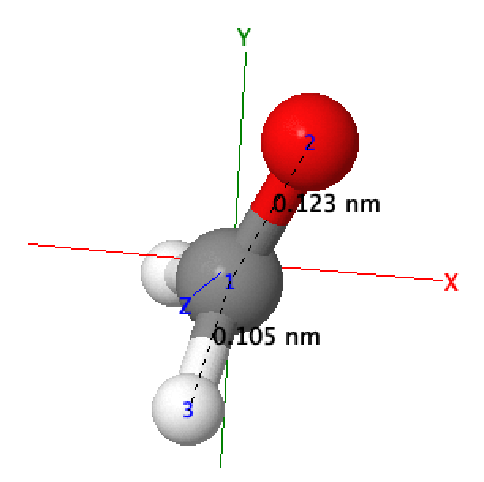
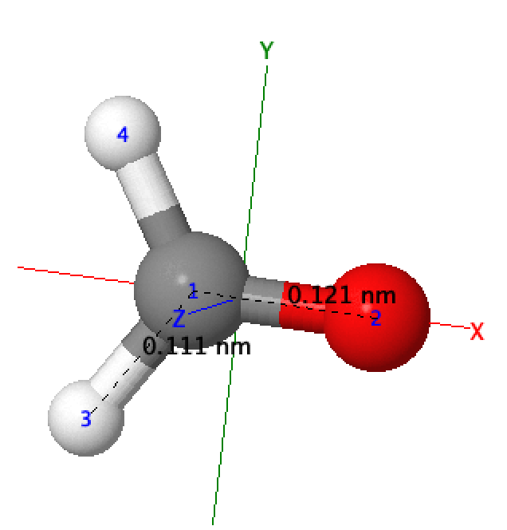
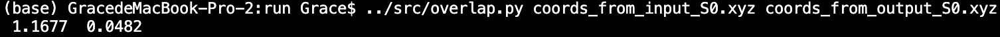
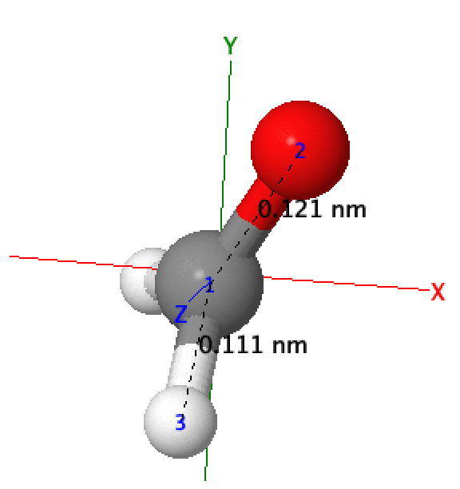

# Rotation
Overlap two rigid bodies by translation followed by rotation. c.f. chapter 5 of the author's dissertation.

## Exercise 

Prepare two input files for program `overlap.py` or `overlap.f90`, and above input files follow the standard file format which can also be executed by general visualizer, like `jmol`. 

The first input file is `coord_from_input_S0.xyz` in folder `./run`, which has C-O bond length as 0.123 nm.

        </img>

 

The second input file is `coord_from_output_S0.xyz` in folder `./run`, which has C-O bond length as 0.121 nm.

        </img>

 

Execute the program  `overlap.py` and change the coordinate of `coords_from_output_S0.xyz` into `shifted.coords_from_output_S0.xyz`. The screenshot is shown as followed. 

        </img>

 

After translation and rotation, RMSD changes from 1.1677 to 0.0482, and the characteristic bond length of C-O is still reserved. 

        </img>

 